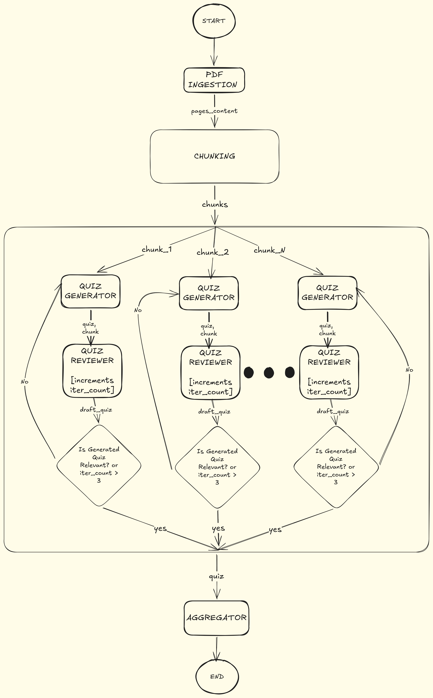

# Quizzer: Async Map-Reduce AI Agent ⚡

An entirely asynchronous, Map-Reduce LangGraph architecture that ingests heavy textbooks and parallelizes LLM quiz generation without context loss.

### Graph Architecture



## Why I Built This

**The Product Problem:** In Nigeria, secondary school teachers and EdTech platforms (like the one I co-founded at [JAMB Prep](https://jambprepacademy.com)) spend countless hours manually reading through massive, 300+ page textbooks just to extract and format exam questions. I needed a way to completely automate this process and export it directly into a format ready for a Learning Management System (LMS).

**The Engineering Problem:** Standard LLM chunking strategies throw away context boundaries. A chunk that ends mid-paragraph gives the model an incomplete picture, resulting in lower-quality questions and hallucinated answers. On top of that, running generation sequentially (chunk 1 → chunk 2 → …) on a heavy textbook takes hours.

**The Solution:** I built an architecture that solves both bottlenecks at once:

- **Context-aware processing:** Text formatting and layout elements like page-number metadata are preserved so the LLM always knows where it is in the source material.
- **Parallel generation with quality gates:** A Map-Reduce subgraph fans out quiz generation across every chunk simultaneously. Each branch has its own LLM Reviewer that scores and retries outputs up to 3 times before merging.

The result is a pipeline that processes a massive textbook in roughly the same wall-clock time it takes to process a single chunk, exporting perfectly structured CSVs ready for database ingestion.

## Architecture

**Pipeline at a glance:**

| Stage                      | Node Name                          | What happens                                                                                                              |
| -------------------------- | ---------------------------------- | ------------------------------------------------------------------------------------------------------------------------- |
| **Ingest**                 | `page_ingestor`                    | Extracts text page-by-page from a PDF file.                                                                               |
| **Chunk**                  | `chunking`                         | Breaks pages into overlapping chunks, preserving page metadata.                                                           |
| **Map (fan-out)**          | `subgraph_generator`               | Each chunk is dispatched to its own generator/reviewer subgraph in parallel via LangGraph's Send API.                     |
| **Generate & Review loop** | `quiz_generator` & `quiz_reviewer` | A generator LLM drafts a quiz, and a reviewer LLM scores it for relevance. If it fails, the generator retries (up to 3×). |
| **Reduce**                 | `aggregator`                       | Merges every approved quiz set back into a single main state.                                                             |
| **Export**                 | `utils.export`                     | Automatically structures the final dataset and exports it as an LMS-ready CSV file.                                       |

## Tech Stack

| Layer             | Technology                                 |
| ----------------- | ------------------------------------------ |
| **Orchestration** | LangGraph (async state graphs + subgraphs) |
| **Validation**    | Pydantic                                   |
| **Logging**       | Loguru                                     |
| **Package Mgmt**  | uv                                         |

## Quickstart

### 1. Clone & install

```bash
git clone https://github.com/Theedon/Quizzer.git
cd Quizzer

uv sync

```

### 2. Configure

```bash
cp .env.example .env
```

### 3. Run the CLI Pipeline

```bash
# Basic run (will output to an auto-timestamped CSV in the outputs/ directory)
uv run -m src.main --input docs/sample_textbook.pdf

# Run with custom output path
uv run -m src.main --input docs/sample_textbook.pdf --output my_custom_quizzes.csv

# Run directly with uvx without cloning repo
OPENAI_API_KEY=sk-*** uvx https://github.com/Theedon/Quizzer.git --input docs/sample_textbook.pdf --output my_custom_quizzes.csv

```

## Project Structure

```text
src/
├── main.py                  # Async CLI entry point
├── utils/
│   └── export.py            # CSV generation & data formatting
├── core/
│   ├── settings.py          # Pydantic-based config (reads .env)
│   └── logger.py            # Loguru setup
└── agent/
    ├── graph.py             # Main graph + Map-Reduce subgraph
    ├── state.py             # TypedDict state definitions
    ├── schemas.py           # Pydantic models for structured LLM output
    ├── prompts.py           # Generation & review prompt templates
    ├── llm.py               # Multi-provider LLM factory
    └── utils/
        ├── ingest_pdf.py         # PDF → page-level text extraction
        └── chunk_pdf_content.py  # Page text → overlapping chunks
```

## Running Tests

```bash
uv run pytest
```

## License

MIT
